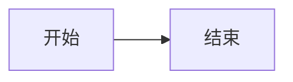

# astro-koharu 文章格式与语法手册

本文列出本站支持的**全部** Markdown 与 Shoka 扩展语法，内容依据仓库中实际的解析器源码（`src/lib/markdown/`、`src/lib/quiz/`）整理，非凭记忆编写。

- 使用场景：写文章时查语法
- 配套文档：`docs/theme-usage.md`（主题安装、配置、部署）
- 所有语法在**本站均已启用**（见文末「开关一览」）

> ⚠️ 重要：写在**代码块内**的语法不会被解析。反引号包裹、`~~~` 围栏、行内代码、数学公式内部一律原样输出——这正是本文能展示语法的原因。

---

## 目录

1. [基础 Markdown / GFM](#1-基础-markdown--gfm)
2. [文字特效](#2-文字特效)
3. [行内属性语法 `{...}`（属性标记）](#3-行内属性语法-属性标记)
4. [颜色与标签](#4-颜色与标签)
5. [提示块（`:::` 语法）](#5-提示块语法)
6. [折叠块 `+++`](#6-折叠块-)
7. [标签页（`;;;` 语法）](#7-标签页语法)
8. [隐藏文字（剧透遮罩）](#8-隐藏文字剧透遮罩)
9. [注音 / 着重号](#9-注音--着重号)
10. [数学公式](#10-数学公式)
11. [代码块增强](#11-代码块增强)
12. [链接嵌入](#12-链接嵌入)
13. [信息图 Infographic](#13-信息图-infographic)
14. [练习题](#14-练习题)
15. [加密内容](#15-加密内容)
16. [友链与多媒体标签](#16-友链与多媒体标签)
17. [Frontmatter 字段](#17-frontmatter-字段)
18. [开关一览](#18-开关一览)

---

## 1. 基础 Markdown / GFM

标准 Markdown 全部可用，另外启用了 GFM 扩展。

```markdown
**粗体**  *斜体*  ~~删除线~~  `行内代码`

- 无序列表
- [x] 已完成任务
- [ ] 未完成任务

| 表头 | 表头 |
| --- | --- |
| 单元格 | 单元格 |

> 引用块

[链接文字](https://example.com)

```

**标题锚点**：h2–h6 自动生成 id 和锚点链接（`rehype-slug` + `rehype-autolink-headings`）。

**Mermaid 图表**：用 `mermaid` 作为代码块语言即可渲染为交互式图表。

````markdown

````

Mermaid 不走代码高亮，直接渲染成图。

---

## 2. 文字特效

### 下划线 `++文字++`

渲染为 `<ins>`。内容不能以空白或 `+` 开头结尾。

```markdown
++下划线文字++
```

配合属性可换样式：`++文字++{.wavy}` 波浪线、`++文字++{.dot}` 点线。

### 高亮 `==文字==`

渲染为 `<mark>`。内容不能以空白或 `=` 开头结尾。

```markdown
==高亮文字==
```

### 下标 `~文字~`（单波浪线）

单个波浪线。**内容不能有空格。**

```markdown
H~2~O
```

### 上标 `^文字^`

**内容不能有空格。**

```markdown
E = mc^2^
```

### 转义

想输出字面量而不触发特效，用反斜杠转义：

```markdown
\++ 不解析为下划线
\== 不解析为高亮
\!! 不解析为遮罩
```

### 保护区域

以下区域内**不会**做特效解析，可放心书写：

- 围栏代码块（```` ``` ```` 或 `~~~`）
- 行内代码 `` `...` ``
- 数学公式 `$...$` 和 `$$...$$`

> ⚠️ `~文字~` 与 GFM 删除线 `~~文字~~` 的区别：单个 `~` 是下标，双个 `~~` 是删除线。

---

## 3. 行内属性语法 `{...}`（属性标记）

这是本站最通用的语法，可在任意元素上追加 class、id 和属性。

**记法**：`.class` 加类名、`#id` 加 id、`key=value` 加属性。可写多个，空格分隔。

**安全限制**：以 `on` 开头的属性（如 `onclick`）会被静默忽略。

### 3.1 行内文字加属性

```markdown
[文字]{.red}
[文字]{.label .success}
[文字]{#my-id title="提示"}
```

### 3.2 块级元素加属性

在元素**下一行**单独写 `{...}`，作用于上一个块级元素：

```markdown
> 这是一段引用
{.warning}
```

### 3.3 列表项加属性

属性写在列表项末尾：

```markdown
- 这是一个列表项{.quiz}
```

---

## 4. 颜色与标签

### 文字颜色

可用颜色：`red` `pink` `orange` `yellow` `green` `aqua` `blue` `purple` `grey`

```markdown
[红色文字]{.red}
[蓝色文字]{.blue}
[紫色文字]{.purple}
```

颜色使用 CSS 变量，**自动适配深色模式**。

### 彩虹文字

```markdown
[彩虹文字]{.rainbow}
```

渐变动画，`prefers-reduced-motion` 下自动停止。

### 键盘按键

```markdown
[Ctrl]{.kbd} + [C]{.kbd}
```

### 标签块

```markdown
[默认]{.label .default}
[主要]{.label .primary}
[信息]{.label .info}
[成功]{.label .success}
[警告]{.label .warning}
[危险]{.label .danger}
```

---

## 5. 提示块（`:::` 语法）

**语法**：`:::样式` 开头，单独一行 `:::` 结尾。内容不能与开头同行。

**可用样式**：`default` 💬、`primary` 💡、`info` ℹ️、`success` ✅、`warning` ⚠️、`danger` 🚫

```markdown
:::warning
这是一条**警告**。
:::

:::info
这是一条信息。
:::

:::tip no-icon
加 `no-icon` 可隐藏图标。
:::
```

**特性**：
- 支持嵌套，最大深度 10 层
- 内容支持完整 Markdown（含列表、代码块）
- 代码块内的 `:::` 不会被处理

> ⚠️ `:::encrypted` 是特例，由加密插件处理，不走提示块逻辑。见 [第 15 节](#15-加密内容)。

---

## 6. 折叠块 `+++`

**语法**：`+++样式 标题` 开头，单独一行 `+++` 结尾。样式与标题之间**必须有空格**。

**可用样式**：`primary` `info` `success` `warning` `danger`

```markdown
+++danger 点击展开
这里是隐藏的**内容**。
+++
```

渲染为原生 `<details>`，无需 JavaScript。

---

## 7. 标签页（`;;;` 语法）

**语法**：`;;;分组ID 标签名` 开头，单独一行 `;;;` 结尾。

**关键规则**：**相同分组 ID** 的连续 `;;;` 块会自动合并为一组标签页。空行不会打断分组。

```markdown
;;;demo 第一个标签
标签一的内容
;;;
;;;demo 第二个标签
标签二的内容
;;;
```

第一个标签默认选中。想开新的一组，换一个分组 ID 即可。

---

## 8. 隐藏文字（剧透遮罩）

```markdown
!!这是遮罩内容!!
```

默认渲染为需要点击才显示的粒子动画遮罩。

### 模糊变体

```markdown
!!模糊文字!!{.blur}
```

渲染为 CSS 模糊效果，悬停或聚焦时显示。

---

## 9. 注音 / 着重号

### 注音（ruby）

```markdown
{漢字^かんじ}
```

渲染为 `<ruby>漢字<rt>かんじ</rt></ruby>`。

### 整个词注音

```markdown
{文字^=注音内容}
```

注音部分以 `=` 开头，会去掉 `=`。

### 着重号

```markdown
{重要^*}
```

注音部分为 `*`，渲染为实心圆点着重号。

**限制**：基准文字与注音都不能包含 `{` `}` `^`；基准文字不能以 `.` 开头（避免与 `.class` 语法冲突）。

---

## 10. 数学公式

基于 KaTeX，语法为标准 LaTeX。

**行内公式**，单个 `$`：

```markdown
质能方程 $E = mc^2$ 说明。
```

**块级公式**，双 `$$`：

```markdown
$$
\int_{-\infty}^{\infty} e^{-x^2} dx = \sqrt{\pi}
$$
```

**注意**：公式内部不做特效解析，`~` 和 `^` 会保持原样。

**文章级开关**：`math: true`（frontmatter）。见 [第 17 节](#17-frontmatter-字段)。

---

## 11. 代码块增强

### 基础

````markdown
```javascript
console.log('hello');
```
````

浅色主题 `github-light`，深色主题 `github-dark`。带复制、全屏按钮。

### 标题与链接

````markdown
```js title="hello.js" url="https://github.com/x/y" linkText="查看源码"
console.log('hello');
```
````

- `title="..."` —— 代码块标题
- `url="..."` —— 关联链接
- `linkText="..."` —— 链接显示文字（不写则显示 url）

### 行高亮

用 `mark:` 指定行号，支持范围，逗号分隔：

````markdown
```js mark:1,3-5
第一行会被高亮
第二行不会
第三行也会被高亮
第四行也会被高亮
第五行也会被高亮
```
````

### 命令行提示符

用 `command:("提示符":行范围)` 给指定行加提示符：

````markdown
```bash command:("$":1-3)
npm install
npm run build
npm run preview
```
````

多个提示符用逗号分隔：`command:("$":1-3,"#":4-5)`

### 自动折叠

**超过 8 行**的代码块会自动折叠。这是自动行为，无需语法。

### 信息图

代码块语言写 `infographic` 会渲染为信息图，见 [第 13 节](#13-信息图-infographic)。这类块不参与自动折叠。

---

## 12. 链接嵌入

**只需把链接单独放一行**，站内会自动识别并嵌入。

```markdown
https://x.com/jack/status/20
```

**识别条件**：该段落只有一个链接，且链接文字就是 URL 本身（即裸链接）。

**支持的平台**：

| 平台 | 效果 |
|---|---|
| Twitter / X 的 `status` 链接 | 嵌入推文卡片 |
| CodePen 的 `pen` / `details` 链接 | 嵌入代码演示 |
| 其他任意网址 | 抓取 OG 元数据生成预览卡片 |

**抓取失败**时自动降级为简单卡片，不会报错。

**缓存**：OG 数据缓存在 `.cache/og-data.json`，默认 30 天。该文件**有意提交到 Git**，可加速 CI 构建。

> 💡 写成 `[文字](url)` 形式**不会**触发嵌入，因为链接文字与 URL 不同。

---

## 13. 信息图 Infographic

基于 `@antv/infographic`。用 `infographic` 作为代码块语言。

````markdown
```infographic
infographic list-row-simple-horizontal-arrow
data
  lists
    - label 步骤一
    - label 步骤二
    - label 步骤三
```
````

- 第一行 `infographic` 后接模板名
- 之后是 YAML 风格的数据定义
- 超过 8 行也不会被自动折叠（与其他代码块行为不同）

---

## 14. 练习题

**启用条件**：全局开关 + 该文章 frontmatter 设置 `quiz: true`。

**语法基础**：用普通列表加 `{.quiz}` 属性。**答案与解析都用嵌套结构表达。**

### 单选题

```markdown
- 1 + 1 = ?{.quiz}
  - 1
  - 2{.correct}
  - 3

> 解析文字（直接跟在列表后）
```

- 用 `{.correct}` 标记正确选项
- 有子列表且不含 `.multi` → 判定为**单选**

### 多选题

同上，但列表项加 `.multi`：

```markdown
- 以下哪些是编程语言？{.quiz .multi}
  - Python{.correct}
  - HTML
  - Rust{.correct}

> 解析文字
```

### 判断题

**不加子列表**即可，用 `.true` 表示答案为真：

```markdown
- 天空是蓝色的。{.quiz .true}

> 解析文字
```

### 填空题

用 `{.gap}` 标记空格：

```markdown
- 日本的首都是 [东京]{.gap}。{.quiz .fill}

> 常见错误：
> - [大阪]{.mistake}
> - [京都]{.mistake}
```

空格内容即为答案。用 `{.mistake}` 标记常见错误，写在解析引用块里。

> ⚠️ 解析引用块必须**紧跟在**题目列表之后，中间不能空行或插入其他内容。

---

## 15. 加密内容

### 加密整篇文章

在 frontmatter 里设置密码：

```yaml
---
title: 我的秘密文章
password: mySecret
---
```

整篇文章加密，需输入密码才能阅读。

### 加密文章片段

```markdown
:::encrypted{password="hunter2"}
这里的内容会被加密。
:::
```

**实现说明**：内容用 AES-256-GCM 加密后存入 HTML 属性，密码本身不会出现在页面里。加密内容会加 `data-pagefind-ignore`，**不被站内搜索索引**。

> ⚠️ 这是前端加密，安全性限于「防止随手浏览」，**不适合存放真正的机密信息**。

---

## 16. 友链与多媒体标签

### 友链卡片

````markdown

- site: 示例站点
  url: https://example.com
  owner: 站长名
  desc: 站点描述
  image: https://example.com/avatar.png
  color: "#3498db"

````

必填 `site` 与 `url`。`color` 需为合法 CSS 颜色（`#hex`、`rgb()`、`hsl()` 或颜色名），非法值会被丢弃。

### 音频

````markdown

- title: 我的歌单
  list:
    - https://example.com/a.mp3
    - https://example.com/b.mp3

````

### 视频

````markdown

- name: 视频标题
  url: https://example.com/video.mp4

````

均为 YAML 格式解析，解析失败会输出 HTML 注释而不报错。

---

## 17. Frontmatter 字段

**必填**：

```yaml
---
title: 文章标题
date: 2026-01-01
---
```

**可选**：

```yaml
---
title: 文章标题
date: 2026-01-01 12:00:00
updated: 2026-01-02 12:00:00  # 显示更新时间
description: 文章摘要            # SEO 与列表展示
link: custom-url                # 自定义 URL，自动转小写
cover: /img/cover/1.webp        # 封面图
tags: [标签一, 标签二]
categories: [笔记]              # 嵌套写法 [笔记, 前端]
subtitle: 副标题
catalog: true                   # 计入分类页统计，默认 true
tocNumbering: true              # 目录自动编号，默认 true
draft: false                    # 草稿
sticky: false                   # 置顶
excludeFromSummary: false       # 排除 AI 摘要与相似度
math: false                     # 启用数学公式
quiz: false                     # 启用练习题
password: mySecret              # 整篇加密
keywords: [关键词一, 关键词二]   # SEO 关键词
---
```

**`description` 优先级**：手写 > AI 摘要 > 正文前 150 字。

**`link` 会自动转小写**：`link: MyPost` → URL 为 `/post/mypost`。建议直接写小写连字符。

**配套示例文章**（本站已上线，可直接参考）：

| 文章 | 演示内容 |
|---|---|
| `/post/custom-keywords` | `keywords` 字段用法 |
| `/post/toc-no-numbering` | `tocNumbering: false` 关闭目录编号 |
| `/post/encrypted-post-demo` | `password` 整篇加密（密码 `demo`） |

---

## 18. 开关一览

全部语法由 `config/site.yaml` 的 `content` 段控制。**本站当前全部启用**：

| 开关 | 本站值 | 控制内容 |
|---|---|---|
| `enableShokaContainers` | ✅ | `:::` 提示块、`+++` 折叠、`;;;` 标签页 |
| `enableShokaHexoTags` | ✅ | ``、`` |
| `enableShokaEffects` | ✅ | `++下划线++`、`==高亮==`、`~下标~`、`^上标^` |
| `enableShokaSpoiler` | ✅ | `!!遮罩!!` |
| `enableShokaRuby` | ✅ | `{注音^かんじ}` |
| `enableShokaAttrs` | ✅ | `{...}` 属性语法（颜色、标签、练习题类名） |
| `enableMath` | ✅ | KaTeX 数学公式 |
| `enableCodeMeta` | ✅ | 代码块 `title` / `mark:` / `command:` |
| `enhanceCodeBlock` | ✅ | 超过 8 行自动折叠 |
| `enableQuiz` | ✅ | 练习题（仍需文章 frontmatter `quiz: true`） |
| `enableEncryptedBlock` | ✅ | `:::encrypted` 与整篇加密 |
| `enableLinkEmbed` | ✅ | 链接自动嵌入 |
| `enableTweetEmbed` | ✅ | 推特嵌入 |
| `enableOGPreview` | ✅ | OG 预览卡片 |
| `enableCodePenEmbed` | ✅ | CodePen 嵌入 |

> ⚠️ 注意 `enableEncryptedBlock` 在**代码里的默认值是 `false`**，本站 `site.yaml` 显式设为了 `true`。如果将来重建站点，需确认这一项。

---

## 附：语法速查

| 语法 | 效果 |
|---|---|
| `++文字++` | 下划线 |
| `==文字==` | 高亮 |
| `~文字~` | 下标 |
| `^文字^` | 上标 |
| `!!文字!!` | 遮罩 |
| `!!文字!!{.blur}` | 模糊遮罩 |
| `{漢字^かんじ}` | 注音 |
| `{文字^*}` | 着重号 |
| `[文字]{.red}` | 彩色文字 |
| `[文字]{.label .success}` | 标签块 |
| `[Ctrl]{.kbd}` | 键盘按键 |
| `[文字]{.rainbow}` | 彩虹文字 |
| `:::warning` ... `:::` | 提示块 |
| `+++danger 标题` ... `+++` | 折叠块 |
| `;;;id 标签名` ... `;;;` | 标签页 |
| `:::encrypted{password="x"}` | 加密片段 |
| `` ... `` | 友链卡片 |
| `` ... `` | 音频播放器 |
| `` ... `` | 视频播放器 |

---

*本文档依据仓库解析器源码整理（`src/lib/markdown/`、`src/lib/quiz/`、`src/lib/config/content.ts`）。语法如有变动，以源码为准。*
