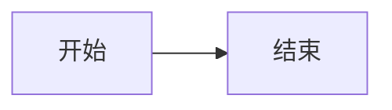

这篇文章演示本站（astro-koharu 主题）支持的**全部**写作语法。所有示例都经过实测，语法说明依据仓库里的解析器源码（`src/lib/markdown/`、`src/lib/quiz/`）整理。

写作时可以直接复制这里的代码块。

:::info
**关于复制**
下面每个示例都放在**行内代码**或**围栏代码块**里——写在代码里的语法不会被解析，所以你看到的源码就是可以照抄的源码。
:::

## 一、基础 Markdown / GFM

标准 Markdown 全部可用，并启用了 GFM 扩展。

```markdown
**粗体**  *斜体*  ~~删除线~~  `行内代码`

- 无序列表
- [x] 已完成任务
- [ ] 未完成任务

| 表头 | 表头 |
| --- | --- |
| 单元格 | 单元格 |

> 引用块

[链接文字](https://example.com)
```

实际效果：

**粗体** *斜体* ~~删除线~~ `行内代码`

- [x] 已完成任务
- [ ] 未完成任务

| 表头 | 表头 |
| --- | --- |
| 单元格 | 单元格 |

> 引用块

### 标题锚点

h2–h6 会自动生成 id 和锚点链接，鼠标悬停标题即可看到链接图标。

### Mermaid 图表

代码块语言写 `mermaid` 即可渲染交互式图表。Mermaid 不走代码高亮。

````markdown

````


## 二、文字特效

### 下划线 `++文字++`

```markdown
++下划线文字++
++波浪下划线++{.wavy}
++点线下划线++{.dot}
```

渲染效果：++下划线文字++、++波浪下划线++{.wavy}、++点线下划线++{.dot}

内容不能以空白或 `+` 开头结尾。

### 高亮 `==文字==`

```markdown
==高亮文字==
```

效果：==高亮文字==。内容不能以空白或 `=` 开头结尾。

### 下标 `~文字~` 与上标 `^文字^`

单个波浪线是下标，双个是删除线。

```markdown
H~2~O 和 E = mc^2^
```

效果：H~2~O 和 E = mc^2^。**上下标内容都不能含空格。**

:::warning
**`~` 与 `~~` 的区别**
`~文字~` 是下标，`~~文字~~` 是 GFM 删除线。这是最容易写错的一处。
:::

### 转义

用反斜杠输出字面量：

```markdown
\++ 不解析为下划线
\== 不解析为高亮
\!! 不解析为遮罩
```

效果：\++ 不解析为下划线，\== 不解析为高亮，\!! 不解析为遮罩。

以下区域内**不做**特效解析，可放心书写：围栏代码块、行内代码、数学公式。

## 三、行内属性语法 `{...}`

这是本站最通用的语法，可给任意元素追加 class、id 和属性。

记法：`.class` 加类名、`#id` 加 id、`key=value` 加属性，空格分隔。

:::danger
**安全限制**
以 `on` 开头的属性（如 `onclick`）会被**静默忽略**，这是防止注入的措施。
:::

### 行内文字

```markdown
[文字]{.red}
[文字]{.label .success}
[文字]{#my-id title="提示"}
```

### 块级元素

在元素**下一行**单独写 `{...}`，作用于上一个块级元素：

```markdown
> 这是一段引用
{.warning}
```

> 这是一段引用
{.warning}

### 列表项

属性写在列表项末尾：

```markdown
- 这是一个列表项{.quiz}
```

## 四、颜色与标签

### 文字颜色

可用颜色：`red`、`pink`、`orange`、`yellow`、`green`、`aqua`、`blue`、`purple`、`grey`。

```markdown
[红色]{.red} [粉色]{.pink} [橙色]{.orange} [黄色]{.yellow}
[绿色]{.green} [青色]{.aqua} [蓝色]{.blue} [紫色]{.purple} [灰色]{.grey}
```

效果：[红色]{.red} [粉色]{.pink} [橙色]{.orange} [黄色]{.yellow} [绿色]{.green} [青色]{.aqua} [蓝色]{.blue} [紫色]{.purple} [灰色]{.grey}

颜色走 CSS 变量，**自动适配深色模式**——切换主题看看上面这行。

### 彩虹文字

```markdown
[彩虹文字]{.rainbow}
```

效果：[彩虹文字]{.rainbow}。渐变动画在 `prefers-reduced-motion` 下自动停止。

### 键盘按键

```markdown
按 [Ctrl]{.kbd} + [C]{.kbd} 复制
```

效果：按 [Ctrl]{.kbd} + [C]{.kbd} 复制

### 标签块

```markdown
[默认]{.label .default} [主要]{.label .primary} [信息]{.label .info}
[成功]{.label .success} [警告]{.label .warning} [危险]{.label .danger}
```

效果：[默认]{.label .default} [主要]{.label .primary} [信息]{.label .info} [成功]{.label .success} [警告]{.label .warning} [危险]{.label .danger}

## 五、提示块 

语法：`:::样式` 开头，单独一行 `:::` 结尾。

:::danger
**这里有个坑**
开头的 `:::样式` 后面**只能跟 `no-icon`**，不能写标题。

`:::warning 我的标题` 这种写法会**整个失败**——渲染成一段普通文字，`:::` 原样露出来，而且不报错。想要标题就写进正文里：

```markdown
:::warning
**我的标题**
正文内容。
:::
```plain
:::

可用样式：`default`、`primary`、`info`、`success`、`warning`、`danger`。

```markdown
:::warning
这是一条**警告**，支持完整 Markdown。
:::
```

:::warning
这是一条**警告**，支持完整 Markdown。
:::

加 `no-icon` 可以隐藏左上角图标：

```markdown
:::tip no-icon
这一块没有图标。
:::
```

:::tip no-icon
这一块没有图标。
:::

**特性**：支持嵌套（最大 10 层）、内容支持完整 Markdown、代码块内的 `:::` 不处理。

:::warning
**`:::encrypted` 是特例**
它由加密插件处理，不走提示块逻辑，见下文「加密内容」。
:::

## 六、折叠块 `+++`

语法：`+++样式 标题` 开头，单独一行 `+++` 结尾。**样式与标题之间必须有空格。**

可用样式：`primary`、`info`、`success`、`warning`、`danger`。

```markdown
+++danger 点击展开
这里是隐藏的**内容**。
+++
```

+++danger 点击展开
这里是隐藏的**内容**，支持完整 Markdown。
+++

渲染为原生 `<details>`，无需 JavaScript。

## 七、标签页 

语法：`;;;分组ID 标签名` 开头，单独一行 `;;;` 结尾。

**关键规则**：相同分组 ID 的连续 `;;;` 块会自动合并为一组，**空行不会打断分组**。

```markdown
;;;demo 第一个标签
标签一的内容
;;;
;;;demo 第二个标签
标签二的内容
;;;
```

;;;demo 第一个标签
标签一的内容。
;;;
;;;demo 第二个标签
标签二的内容。
;;;

第一个标签默认选中。想开新的一组，换个分组 ID 即可。

## 八、隐藏文字（剧透遮罩）

```markdown
!!这是遮罩内容!!
```

效果：!!这是遮罩内容!!

默认是需要在点击后显示的粒子动画遮罩。

### 模糊变体

```markdown
!!模糊文字!!{.blur}
```

效果：!!模糊文字!!{.blur}（悬停或聚焦时显示）

## 九、注音与着重号

### 注音（ruby）

```markdown
{漢字^かんじ}
```

效果：{漢字^かんじ}

### 整词注音

注音部分以 `=` 开头，渲染时会去掉 `=`：

```markdown
{文字^=注音内容}
```

效果：{文字^=注音内容}

### 着重号

注音部分写 `*`：

```markdown
{重要^*}
```

效果：{重要^*}

**限制**：基准文字与注音都不能包含 `{`、`}`、`^`；基准文字不能以 `.` 开头（避免与 `.class` 语法冲突）。

## 十、数学公式

基于 KaTeX，标准 LaTeX 语法。需要在 frontmatter 里设置 `math: true`。

**行内公式**用单个 `$`：

```markdown
质能方程 $E = mc^2$ 说明。
```

效果：质能方程 $E = mc^2$ 说明。

**块级公式**用双 `$$`：

```markdown
$$
\int_{-\infty}^{\infty} e^{-x^2} dx = \sqrt{\pi}
$$
```

效果：

$$
\int_{-\infty}^{\infty} e^{-x^2} dx = \sqrt{\pi}
$$

:::info
**公式内部不做特效解析**
`~` 和 `^` 在公式里保持原样，不会被当成上下标。
:::

## 十一、代码块增强

### 基础

````markdown
```javascript
console.log('hello');
```
````

浅色主题用 `github-light`，深色用 `github-dark`。带复制和全屏按钮。

### 标题与链接

````markdown
```js title="hello.js" url="https://github.com/x/y" linkText="查看源码"
console.log('hello');
```
````

```js title="hello.js" url="https://github.com/x/y" linkText="查看源码"
console.log('hello');
```

三个可选参数：`title` 标题、`url` 关联链接、`linkText` 链接文字（不写则显示 url）。

### 行高亮

用 `mark:` 指定行号，支持范围，逗号分隔：

````markdown
```js mark:1,3-5
第一行会被高亮
第二行不会
第三行也会被高亮
第四行也会被高亮
第五行也会被高亮
```
````

```js mark:1,3-5
第一行会被高亮
第二行不会
第三行也会被高亮
第四行也会被高亮
第五行也会被高亮
```

### 命令行提示符

用 `command:("提示符":行范围)` 给指定行加提示符：

````markdown
```bash command:("$":1-3)
npm install
npm run build
npm run preview
```
````

```bash command:("$":1-3)
npm install
npm run build
npm run preview
```

多个提示符用逗号分隔：`command:("$":1-3,"#":4-5)`

### 自动折叠

**超过 8 行**的代码块会自动折叠，这是自动行为，无需任何语法。

## 十二、链接嵌入

**只需把链接单独放一行**，站内会自动识别并嵌入。

```markdown
https://x.com/jack/status/20
```

**识别条件**：该段落只有一个链接，且链接文字就是 URL 本身（裸链接）。

| 平台 | 效果 |
|---|---|
| Twitter / X 的 `status` 链接 | 嵌入推文卡片 |
| CodePen 的 `pen` / `details` 链接 | 嵌入代码演示 |
| 其他任意网址 | 抓取 OG 元数据生成预览卡片 |

抓取失败会自动降级为简单卡片，**不会报错**。

:::warning
**写成 Markdown 链接就不会嵌入**
`[文字](https://example.com)` **不会**触发嵌入，因为链接文字与 URL 不同。必须是裸链接。
:::

OG 数据缓存在 `.cache/og-data.json`，默认 30 天。该文件有意提交到 Git 以加速构建。

## 十三、信息图 Infographic

基于 `@antv/infographic`，用 `infographic` 作为代码块语言。

````markdown
```infographic
infographic list-row-simple-horizontal-arrow
data
  lists
    - label 步骤一
    - label 步骤二
    - label 步骤三
```
````

```infographic
infographic list-row-simple-horizontal-arrow
data
  lists
    - label 采集数据
    - label 清洗与标注
    - label 训练与评估
```

第一行 `infographic` 后接模板名，之后是 YAML 风格的数据定义。**信息图不吃自动折叠**，超过 8 行也不会折叠。

## 十四、练习题

需要**全局开关**加上该文章 frontmatter 里设 `quiz: true`（本文已开）。

语法基础是普通列表加 `{.quiz}` 属性，**答案与解析都用嵌套结构表达**。

### 单选题

有子列表且不含 `.multi` → 判定为单选。用 `{.correct}` 标记正确选项。

```markdown
- 1 + 1 = ?{.quiz}
  - 1
  - 2{.correct}
  - 3

> 解析文字，直接跟在列表后面
```

- 1 + 1 = ?{.quiz}
  - 1
  - 2{.correct}
  - 3

> 这是解析：小学算术。

### 多选题

加 `.multi`：

```markdown
- 以下哪些是编程语言？{.quiz .multi}
  - Python{.correct}
  - HTML
  - Rust{.correct}

> 解析文字
```

- 以下哪些是编程语言？{.quiz .multi}
  - Python{.correct}
  - HTML
  - Rust{.correct}

> HTML 是标记语言，不是编程语言。

### 判断题

**不加子列表**即可，用 `.true` 表示答案为真：

```markdown
- 天空是蓝色的。{.quiz .true}

> 解析文字
```

- 天空是蓝色的。{.quiz .true}

> 晴朗天气下确实如此。

### 填空题

用 `{.gap}` 标记空格，空格内容即为答案：

```markdown
- 日本的首都是 [东京]{.gap}。{.quiz .fill}

> 常见错误：
> - [大阪]{.mistake}
> - [京都]{.mistake}
```

- 日本的首都是 [东京]{.gap}。{.quiz .fill}

> 常见错误：
> - [大阪]{.mistake}
> - [京都]{.mistake}

:::danger
**解析引用块的位置有讲究**
必须**紧跟在**题目列表之后，中间不能空行或插入其他内容，否则解析不会被识别。
:::

## 十五、加密内容

### 加密整篇文章

在 frontmatter 里设置密码：

```yaml
---
title: 我的秘密文章
password: mySecret
---
```

### 加密文章片段

```markdown
:::encrypted{password="hunter2"}
这里的内容会被加密。
:::
```

:::encrypted{password="hunter2"}
这里的内容会被加密。输入 `hunter2` 可以解开——**这个密码是公开写在源码里的，只是演示**。
:::

内容用 AES-256-GCM 加密后存入 HTML 属性，密码本身不出现在页面里。加密内容带 `data-pagefind-ignore`，**不被站内搜索索引**。

:::warning
**这是前端加密**
安全性限于「防止随手浏览」，**不适合存放真正的机密信息**。密码在前端校验，懂技术的人可以直接读源码。
:::

## 十六、友链与多媒体标签

### 友链卡片

```markdown

- site: 示例站点
  url: https://example.com
  owner: 站长名
  desc: 站点描述
  image: https://example.com/avatar.png
  color: "#3498db"

```


- site: astro-koharu
  url: https://github.com/D-Sketon/astro-koharu
  owner: D-Sketon
  desc: 本主题上游仓库
  color: "#3498db"


必填 `site` 与 `url`。`color` 需为合法 CSS 颜色（`#hex`、`rgb()`、`hsl()` 或颜色名），非法值会被丢弃。

### 音频

```markdown

- title: 我的歌单
  list:
    - https://example.com/a.mp3
    - https://example.com/b.mp3

```

### 视频

```markdown

- name: 视频标题
  url: https://example.com/video.mp4

```

两者都是 YAML 格式解析，解析失败会输出 HTML 注释而**不报错**。

## 十七、Frontmatter 字段

**必填**只有两个：

```yaml
---
title: 文章标题
date: 2026-01-01
---
```

**常用可选**字段：

```yaml
---
title: 文章标题
date: 2026-01-01 12:00:00
updated: 2026-01-02 12:00:00  # 显示更新时间
description: 文章摘要            # SEO 与列表展示
link: custom-url                # 自定义 URL，自动转小写
cover: /img/cover/1.webp        # 封面图
tags: [标签一, 标签二]
categories: [笔记]              # 嵌套写法 [笔记, 前端]
subtitle: 副标题
catalog: true                   # 显示目录，默认 true
tocNumbering: true              # 目录自动编号，默认 true
draft: false                    # 草稿
sticky: false                   # 置顶
excludeFromSummary: false       # 排除 AI 摘要与相似度
math: false                     # 启用数学公式
quiz: false                     # 启用练习题
password: mySecret              # 整篇加密
keywords: [关键词一, 关键词二]   # SEO 关键词
---
```

几点说明：

- **`description` 优先级**：手写 > AI 摘要 > 正文前 150 字
- **`link` 会自动转小写**：`link: MyPost` → URL 为 `/post/mypost`，建议直接写小写连字符
- **分类决定 URL**：`categories: [[示例]]` 对应 `categoryMap` 里的 `示例: sample`，所以本文路径是 `/categories/sample`

## 十八、开关一览

所有语法由 `config/site.yaml` 的 `content` 段控制。**本站当前全部启用**：

| 开关 | 控制内容 |
|---|---|
| `enableShokaContainers` | `:::` 提示块、`+++` 折叠、`;;;` 标签页 |
| `enableShokaHexoTags` | ``、`` |
| `enableShokaEffects` | `++下划线++`、`==高亮==`、`~下标~`、`^上标^` |
| `enableShokaSpoiler` | `!!遮罩!!` |
| `enableShokaRuby` | `{注音^かんじ}` |
| `enableShokaAttrs` | `{...}` 属性语法 |
| `enableMath` | KaTeX 数学公式 |
| `enableCodeMeta` | 代码块 `title` / `mark:` / `command:` |
| `enhanceCodeBlock` | 超过 8 行自动折叠 |
| `enableQuiz` | 练习题（仍需 frontmatter `quiz: true`） |
| `enableEncryptedBlock` | `:::encrypted` 与整篇加密 |
| `enableLinkEmbed` / `enableTweetEmbed` / `enableOGPreview` / `enableCodePenEmbed` | 链接自动嵌入 |

:::info
**一个容易踩的坑**
`enableEncryptedBlock` 在**代码里的默认值是 `false`**，本站是在 `site.yaml` 里显式设成 `true` 才生效的。将来若重建站点，记得确认这一项。
:::

## 附：速查表

| 语法 | 效果 |
|---|---|
| `++文字++` | 下划线 |
| `==文字==` | 高亮 |
| `~文字~` | 下标 |
| `^文字^` | 上标 |
| `!!文字!!` | 遮罩 |
| `!!文字!!{.blur}` | 模糊遮罩 |
| `{漢字^かんじ}` | 注音 |
| `{文字^*}` | 着重号 |
| `[文字]{.red}` | 彩色文字 |
| `[文字]{.label .success}` | 标签块 |
| `[Ctrl]{.kbd}` | 键盘按键 |
| `[文字]{.rainbow}` | 彩虹文字 |
| `:::warning` …… `:::` | 提示块 |
| `+++danger 标题` …… `+++` | 折叠块 |
| `;;;id 标签名` …… `;;;` | 标签页 |
| `:::encrypted{password="x"}` | 加密片段 |
| `` …… `` | 友链卡片 |
| `` …… `` | 音频播放器 |
| `` …… `` | 视频播放器 |

---

语法如有变动，以 `src/lib/markdown/` 下的解析器源码为准。
